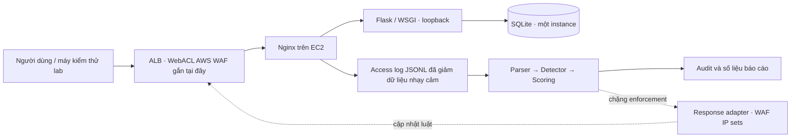

# Quyết định kiến trúc: EC2 sau ALB

Ngày chốt: 2026-09-10. Đây là kiến trúc đích; chặng 1 mới kiểm chứng proxy local.

## Vì sao lựa chọn này cần hai lớp bảo vệ

**Firewall Linux (iptables hoặc UFW)** vẫn là phần bắt buộc của đề tài: giới hạn cổng
ứng dụng, quản trị, traffic vào EC2 và bảo vệ origin khỏi truy cập ngoài luồng đã chốt.
Không dùng firewall host để chặn IP HTTP client lấy từ XFF: khi qua ALB, peer TCP
của EC2 là ALB. Nếu block nhầm peer ALB, nhiều người dùng có thể cùng mất truy cập.

**AWS WAF** gắn với ALB xử lý request HTTP ở ingress. Managed/signature/rate-based
rules và IP sets là lớp enforcement phù hợp cho mô hình này. Analyzer tự xây dựng
vẫn là phần nhận diện, đánh giá rủi ro và tạo yêu cầu block tạm thời. WAF adapter
hiện chỉ là placeholder; chưa có bằng chứng block thực tế.

Như vậy bài báo cáo vẫn có tìm hiểu và xây dựng firewall Linux, đồng thời trình bày
đúng giới hạn L3/L4 và lớp HTTP. Không mô tả UFW là công cụ chữa SQLi hoặc XSS.

## Network contract khi sang AWS

1. ALB internet-facing dùng subnet ở ít nhất hai Availability Zones. Số EC2 ban đầu
   là một để giữ lab đơn giản; không gọi đây là hệ thống HA hoàn chỉnh.
2. Security Group EC2 chỉ cho cổng Nginx/health check từ **Security Group của ALB**;
   không mở cổng app WSGI/SQLite ra Internet. Quyền quản trị được thiết kế riêng.
3. Chọn public/private placement, đường egress và cách quản trị theo ngân sách trước
   khi tạo tài nguyên; chặng 1 không cố định subnet, region, IP hoặc port AWS.
4. ALB XFF ở chế độ append; tắt client-port preservation cho contract parser hiện tại.
5. Nginx log peer gốc và XFF thô. Nếu dùng realip module, lưu đúng peer gốc; không
   dùng địa chỉ đã rewrite để quyết định ai là trusted proxy.
6. `trusted_proxies`: CIDR cụ thể của subnet ALB. `alb_networks`, `admin_networks`
   phải được bảo vệ khỏi block. Trust bằng CIDR phải đi cùng isolation qua SG.
7. Health check `/healthz` phải hoạt động. Analyzer chỉ loại `GET /healthz` không query
   khỏi flood khi peer thuộc `trusted_proxies` và request không có XFF; audit ghi
   `policy_skip`. Client qua ALB có XFF vẫn bị tính. Không dùng User-Agent hay header
   client tùy ý để bỏ qua; phải đối chiếu access log target thật khi triển khai AWS.
8. HTTPS termination/certificate, host allowlist và cookie Secure được hoàn thiện trước
   khi dùng tài khoản thật. Local HTTP ở chặng 1 chỉ là ngoại lệ trong loopback lab.

AWS hướng dẫn [giới hạn traffic target bằng SG nguồn của ALB](https://docs.aws.amazon.com/elasticloadbalancing/latest/application/load-balancer-update-security-groups.html).
ALB có các [chế độ XFF append/preserve/remove và tùy chọn client port](https://docs.aws.amazon.com/elasticloadbalancing/latest/application/x-forwarded-headers.html).
Điều kiện subnet nằm trong [tài liệu ALB](https://docs.aws.amazon.com/elasticloadbalancing/latest/application/application-load-balancers.html).

## Kịch bản cần chứng minh để báo cáo

| Kịch bản | Bằng chứng cần có | Chặng |
| --- | --- | --- |
| Người dùng đăng nhập và đặt đơn mô phỏng | HTTP + DB, session/CSRF, giá tính ở server | 1 |
| Request qua proxy được log và nhận diện | HTTP local → JSONL → detection/decision | 1 |
| XFF giả không thay được IP thật | Test trusted-peer + rightmost untrusted hop | 1 |
| Client không truy cập vòng qua ALB | Kiểm tra SG origin và firewall Linux | 2–3 |
| Firewall Linux chỉ mở luồng cần thiết | Luật đã review, test allow/deny, quản trị vẫn hoạt động | 2–3 |
| WAF chặn và gỡ chặn IP lab | Audit API, HTTP trước/sau, TTL và rule state | 4 |
| Flood vượt ngưỡng nhưng traffic hợp lệ vẫn chạy | Số liệu giới hạn, test allowlist, false-positive rate | 4 |

SQLi/XSS/traversal chỉ là dấu hiệu trong log. Website phải tự an toàn bằng parameterized
queries, output encoding/CSP và allowlist đường dẫn. Detection sau log có độ trễ và
không bảo đảm ngăn request đầu tiên. Test local thành công không thay thế test Nginx,
AWS WAF, bandwidth hoặc tải phân tán.
